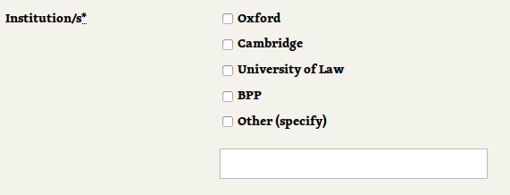

# This is a first chapter

When you deal with complex forms **The Rails Way is not enough**. You have to introduce another **abstraction** for handling more sophisticated validations.

This post shows how to use **form objects** for validations which need to happen only in one flow and involve dependencies between the fields.

This post is based on the form which I developed for one of my clients - Oxbridge Notes. It's an application form for [law tutors](https://www.oxbridgenotes.co.uk/) who are willing to work for Oxbridge Notes. I will simplify the details of the underlining model to cover only the interesting patterns. The model in the example is called ```Tutor``` and the schema for it looks as follows:

```ruby
create_table "tutors", force: :cascade do |t|
  t.text     "name"
  t.string   "institutions",           array: true
  t.boolean  "skype_available",        null: false
  t.boolean  "email_available",        null: false
  t.boolean  "in_person_available",    null: false
  t.string   "postcode"
  t.datetime "created_at",             null: false
  t.datetime "updated_at",             null: false
end
```

As you can see I'm using a ```NOT NULL``` constraint for boolean fields to avoid.

## Requirements

1. User has to select at least one option of: "skype", "email" and "in person".
2. Postcode has to be present when "in person" is selected.
3. Institutions selection is rendered as a group of checkboxes and allows to specify "other option" (see the screenshot below). However, it has to be saved as an array of strings.

\


## Form object

We don't want these rules to be enforced on the model level. They are **valid for this particular use case** (user fills in the application form), but they are not general rules. For example, the administrator may want to temporarily disable the tutor by setting ```skype_available```, ```email_available``` and ```in_person_available``` to ```false```. If the validations were placed in the model, we would have to use some **nasty hacks** (skipping validations) to achieve this. And when you start skipping validations you are already doomed. You may end up with 25 users with email set to ```null``` (as we did in Oxbridge Notes).

We don't want to mix **validations for data consistency** (validations on the model level) with our **business logic validations**.

That's why I'm going to introduce the form object to handle this use case.

We could use a gem like [Reform](https://github.com/apotonick/reform), but rolling out our own implementation is pretty simple. We will use ```ActiveModel::Model``` module.

```ruby
class TutorApplicationForm
  include ActiveModel::Model
end
```

Let's add ```tutor``` field, initialize it and delegate some fields to it:

```ruby
class TutorApplicationForm
  # [...]

  delegate :name, :skype_available, :email_available, :in_person_available,
    :postcode, to: :tutor

  attr_accessor :tutor

  def initialize
    self.tutor = Tutor.new
  end
end
```

The public interface of our form object consists of two methods - ```assign``` and ```save```. I believe that this separation is a better way than one big ```save``` method which handles attribute assignment, saving and error handling.

Let's start with ```TutorApplicationForm#save```. We have to run both the model level validations - ```tutor.valid?``` and the form object level validations - ```self.valid?```

```ruby
class TutorApplicationForm
  # [...]

  def save
    tutor_valid = tutor.valid?

    if valid? && tutor_valid
      tutor.save
    else
      tutor.errors.each do |field, error|
        errors.add(field, error)
      end

      false
    end
  end
end
```

In order to get the errors from the two sources we have to make sure that both ```self.valid?``` and ```tutor.valid?``` are executed. Unfortunately, ```if valid? && tutor.valid?``` won't execute ```tutor.valid?``` if ```self.valid?``` is false, so we won't get errors for the tutor model. That's why we have to provide workaround as presented above.

We also **copy all errors** from ```tutor``` to combine them with errors from the form object.

Next, we have to implement ```TutorApplicationForm#assign```:

```ruby
class TutorApplicationForm
  # [...]

  attr_accessor :tutor, :selected_institutions, :other_institution

  def assign(params)
    params.permit!

    self.selected_institutions = params[:selected_institutions]
    self.other_institution = params[:other_institution]

    tutor.assign_attributes(params.slice(:name, :skype_available, :email_available,
      :in_person_available, :postcode))

    tutor.institutions = calculate_institutions
  end

  # [...]
end
```

We call ```params.permit!``` to bypass Strong Parameters, because we are using ```params.slice``` to have total control which values are passed to ```tutor```.

Institutions come to us as two separate parameters - ```selected_institutions``` (from group of checkboxes) and ```other_institution``` (from "other" field). We have to store them inside ```TutorApplicationForm``` object so they are displayed correctly when the form is re-rendered (when there are errors).

We have to transform these two parameters into one array of institutions. Take a look at ```calculate_institutions``` method:

```ruby
class TutorApplicationForm
  # [...]

  private

    def calculate_institutions
      (selected_institutions + [other_institution]).
        select(&:present?).
        reject { |element| element == "Other (specify)" }
    end
end
```

Here we join the parameters, remove blank elements and remove the "other" option from the checkbox group (useless for us).

## Validations

Now when we have the implementation of the form object in place, adding the validations is pretty simple. Let's start by validating the postcode when "in person" is checked:

```ruby
class TutorApplicationForm
  # [...]

  validates_presence_of :postcode, if: :in_person_available

  # [...]
end
```

Next, we have to validate that at least one of: "skype", "email" or "in person" is checked:

```ruby
class TutorApplicationForm
  # [...]

  validate :at_least_one_format

  # [...]

  private

    def at_least_one_format
      if [skype_available, email_available, in_person_available].all?(&:blank?)
        errors.add(:format, "has to be selected")
      end
    end

  # [...]
end
```

We can also add validations to ```Tutor``` model and the errors will be correctly collected and displayed:

```ruby
class Tutor < ActiveRecord::Base
  validates_presence_of :name, :institutions
end
```

## Conclusions

Don't mix data consistency validations with business logic validations. **Use form objects to decouple them**.
